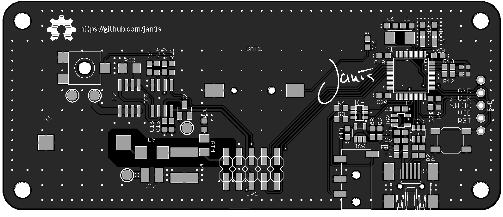
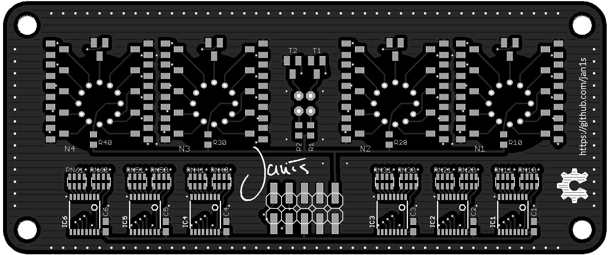
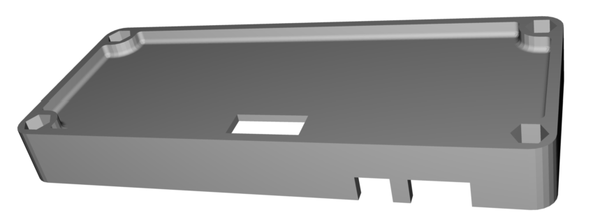

# hw-nixieclock-mini

This is the repository describing the hardware for the nixieclock used in the 32c3 workshop.

The firmware running on the clock: [Firmware](https://github.com/jan1s/fw-clock)

A small Gist to configure a STM32 toolchain on Mac: [Toolchain](https://gist.github.com/jan1s/d2cafa13cdc2b2f5d7b3)

To flash the controller a STM32 Programmer is needed, just get the cheapest one on [Aliexpress][aliexpress].

The host software to configure the clock via serial port: [Host Software](https://github.com/jan1s/cpp-nchron)

## PCB Errata (rev. a)

In the first revision of the PCBs are some minor errors.

* SCL of the shift registers are floating, they need to be connected to 5V
* A pullup resistor is missing on the USB data lines
* LED silkscreen missing, they are on the right of the controller

## PCBs

The clock has seperate control and display pcbs. Those pcbs do not only form a basic case for the electronics, but also allow for flexible use with different tubes.

 

 

## Case

 

## BOM
| Identifier | Type/Value | Quantity | [Reichelt][reichelt] | [Digikey][digikey] | Comment |
| :---        | :---        | :---      | :---         | :---      | :---     |
| R1, R2, R3, R4 | 33 Ω | 4 | SMD-0603 33 | 311-33GRCT-ND |
| R12, R13 | 1 kΩ | 2 | SMD-0603 1,00K | 311-1.0KGRCT-ND |
| C1, C2, C13, C14 | 10 pF | 4 | NPO-G0603 10P |  |
| C7, C8 | 10 nF | 2 | X7R-G0603 10N |  |
| C18, C19, C20, C21 | 100 nF | 4 | X7R-G0603 100N |  |
| C3, C5, C6, C10, C11 | 10 µF | 5 | X5R-G0603 10/6 |  |
| FB1 | Ferrite Bead | 1 | BLM18AG 121 | 490-1011-1-ND |
| Y1 | 8MHz | 1 | - | 535-10630-1-ND |
| Y2 | 32kHz | 1 | 32,768 PGD-9 | 535-9542-1-ND |
| LED1 | LED green | 1 | LG L29K |  |
| LED2 | LED white | 1 | LW L283 | |
| BAT1 | Batteryholder | 1 | - | BC501SM-ND |
| BAT | CR 1220 | 1 | CR 1220 VAR | SY033-ND |
| SW1 | Tact Switch Top | 1 | - | EG2531CT-ND |
| J1 | 2x5 Socket | 1 | - | A100866TR-ND, S5714-ND |
| J2 | USB Jack | 1 | USB BWM SMD | 151-1206-1-ND |
| IC1 | STM32F103C8T6 | 1 | STM32 F103C8T6 | 497-6063-ND |
| IC2, IC6 | LP2985 | 1 | LP 2985 IM5-3,3 |  |
| IC3, IC4 | USBLC6-2 | 1 | - | 497-5235-1-ND |

## Power supply - BOM
| Identifier | Type/Value | Quantity | [Reichelt][reichelt] | [Digikey][digikey] | Comment |
| ---        | ---        | ---      | ---         | ---      | ---     |
| R23 | 0.01 Ω | 1 | - | RHM.10MCT-ND |
| R18 | 82 kΩ | 1 | SMD-0603 82K |  |
| R20 | 8,2 kΩ | 1 | SMD-0603 8,2K |  |
| R19 | 1 MΩ | 1 | SMD-1206 1M |  |
| C12 | 150 pF | 1 | NPO-G0603 150P |  |
| C9 | 22 nF | 1 | X7R-G0603 22N |  |
| C4 | 1 µF / 250V | 1 | 1u/250V | 490-3550-1-ND  | |
| C15, C16 | 10 µF | 2 | X5R-G0603 10/6 |  |
| C17 | 100 µF | 1 | X5R-G1210 100 |  |
| D2 | Diode | 1 | BAT 54C SMD |  |
| D3 | Diode | 1 | ES 2GA SMD |  |
| L2 | 680 µH | 1 | L-PISR 680µ |  |
| IC7 | IRF 7470 | 1 | IRF 7470 | IRF7470PBFCT-ND |
| IC5 | LT1619ES8 | 1 | - | LT1619ES8#PBF-ND |

## Display Board - BOM
| Identifier | Type/Value | Quantity | [Reichelt][reichelt] | [Digikey][digikey] | Comment |
| ---        | ---        | ---      | ---         | ---      | ---     |
| R1-R2 | 220 kΩ | 2 | SMD-0603 220K |  |
| R10-R46 | 22 kΩ | 4 | SMD-0603 22K |  |
| RN10-RN61| 4x10 kΩ | 12 | BCN16 10K |  |
| C1-C6 | 100 nF | 6 | X7R-G0603 100N |  |
| T1-T69 | SMBTA 42 SMD | 46 | SMBTA 42 SMD | SMBTA42E6327INCT-ND |
| IC1-IC6 | 74HC595PW | 6 |  | 568-2263-1-ND |
| JP1 | 2x5pol Header | 1 | SL 2X10G SMD2,54 | 609-4723-ND |
| GL1, GL2 | Neon Bulb | 2 | GLIMMLAMPE | C2A-ND |

## Case - BOM
| Identifier | Type/Value | Quantity | [Reichelt][reichelt] | [Digikey][digikey] | Comment |
| ---        | ---        | ---      | ---         | ---      | ---     |
| - | Spacer bolts | 4 | DI 12MM | - |
| - | Feet | 4 | GF 63 | - |

[reichelt]: http://www.reichelt.de
[digikey]: http://www.digikey.de
[mouser]: http://mouser.com
[aliexpress]: http://www.aliexpress.com
