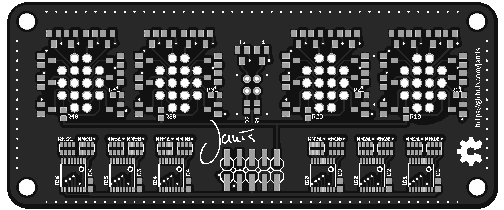
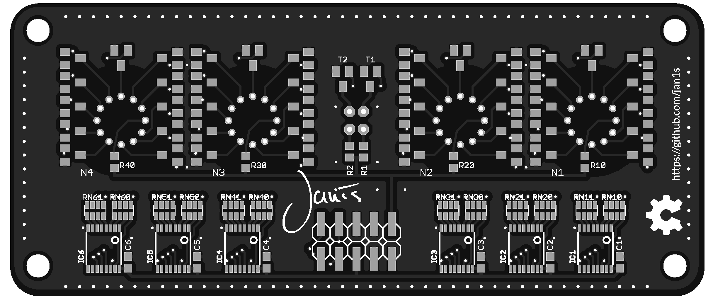
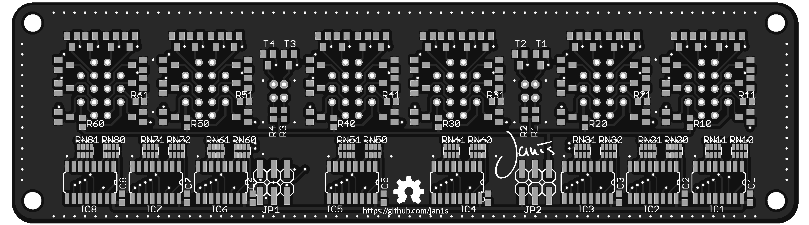
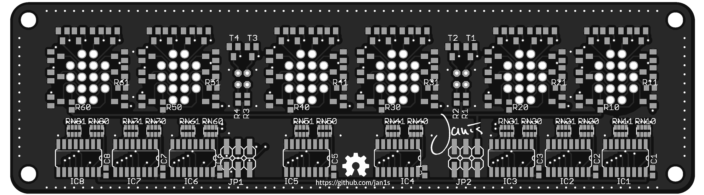
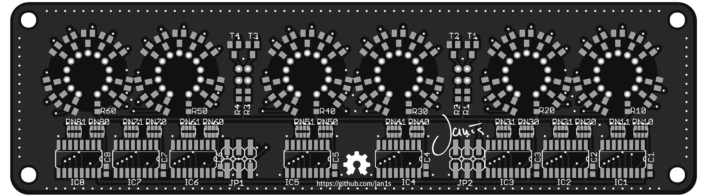
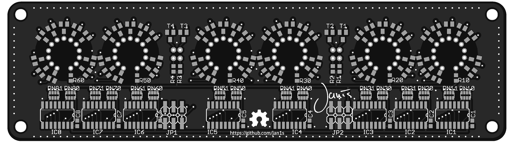
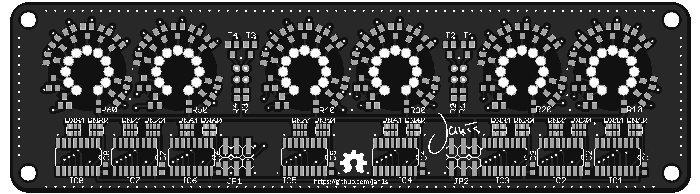
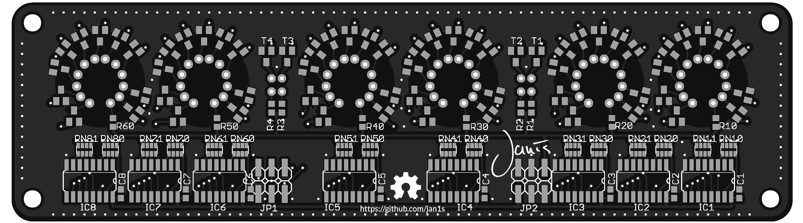
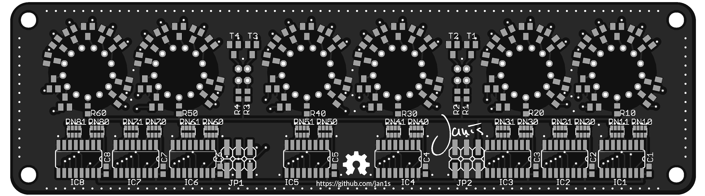

# Display PCBs

## d100

The display boards with 100mm width use a smaller variant of the 74hc595 shift register.

### d100 ZM1000

rev. a

In rev a of the PCB is an error. (This is the version from the 32C3 workshop)
Find detailed pictures of the first prototype [here](../../docu/detail_d100_zm1325_rev_a).

* SCL of the shift registers are floating, they need to be connected to 5V

rev. b

### d100 ZM1325

rev. a

In rev a of the PCB is an error. (This is the version from the 32C3 workshop)

* SCL of the shift registers are floating, they need to be connected to 5V

 
rev. b

### d100 BOM

| Identifier | Type/Value | Quantity | [Reichelt][reichelt] | [Digikey][digikey] | Comment |
| ---        | ---        | ---      | ---         | ---      | ---     |
| R1-R2 | 220 kΩ | 2 | SMD-0603 220K |  |
| R10-R46 | 22 kΩ | 4 | SMD-0603 22K |  |
| RN10-RN61| 4x10 kΩ | 12 | BCN16 10K |  |
| C1-C6 | 100 nF | 6 | X7R-G0603 100N |  |
| T1-T69 | SMBTA 42 SMD | 46 | SMBTA 42 SMD | SMBTA42E6327INCT-ND |
| IC1-IC6 | 74HC595PW | 6 |  | 568-2263-1-ND |
| JP1 | 2x5pol Header | 1 | SL 2X10G SMD2,54 | 609-4723-ND |
| GL1, GL2 | Neon Bulb | 2 | GLIMMLAMPE | C2A-ND |

##d150

The display boards with 150mm width use 8 74hc595d shift registers.

### d150 ZM1000

rev. a

 
rev. a, socketed

### d150 Z570M

rev. a

rev. b

### d150 IN-8

rev. a

rev. b

### d150 IN-8-2

rev. a

### d150 IN-14

 
rev. a

rev. b

### d150 BOM

| Identifier | Type/Value | Quantity | [Reichelt][reichelt] | [Digikey][digikey] | Comment |
| ---        | ---        | ---      | ---         | ---      | ---     |
| R1-R4 | 220 kΩ | 4 | SMD-0603 220K |  |
| R10-R60 | 22 kΩ | 6 | SMD-0603 22K |  |
| RN10-RN81| 4x10 kΩ | 16 | BCN16 10K |  |
| C1-C8 | 100 nF | 8 | X7R-G0603 100N |  |
| T1-T69 | SMBTA 42 SMD | 64 | SMBTA 42 SMD | SMBTA42E6327INCT-ND |
| IC1-IC8 | 74HC595D | 8 | SMD HC 595 | |
| JP1, JP2 | 2x3pol Header | 2 | SL 2X10G SMD2,54 | |
| GL1-GL4 | Neon Bulb | 4 | GLIMMLAMPE | C2A-ND |

[reichelt]: http://www.reichelt.de
[digikey]: http://www.digikey.de
[mouser]: http://mouser.com
[aliexpress]: http://www.aliexpress.com
